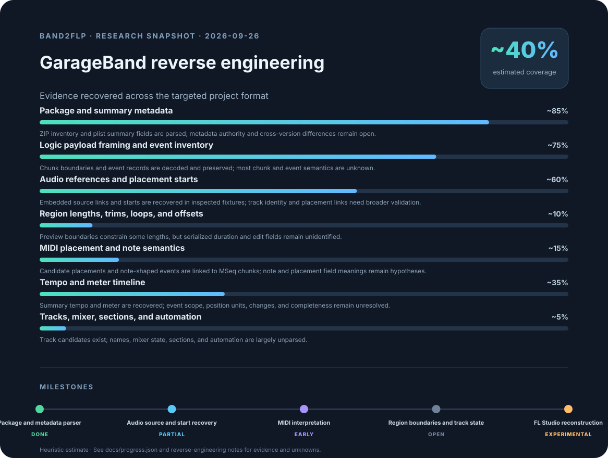

# band2flp

Research tools for recovering GarageBand project structure into a neutral model and exporting supported data to FL Studio.

Licensed under the [MIT License](LICENSE).

Community participation follows the [Code of Conduct](CODE_OF_CONDUCT.md). Contribution guidance is in [CONTRIBUTING.md](CONTRIBUTING.md).

## Why this project exists

GarageBand, Ableton Live, and FL Studio each have their own project formats and workflows. `band2flp` aims to make cross-DAW collaboration easier, so collaborators can work from a shared song without everyone needing to learn and own a license for every DAW in the chain. It does this by recovering song data into a neutral model, then exporting supported data for another DAW. Current work focuses on GarageBand projects and experimental FL Studio export; Ableton export and complete project conversion are not implemented yet.

The graphic is a rough estimate of format knowledge recovered, not a measure of converter completeness. See docs/progress.json for its evidence-based workstream estimates.

## What it can do now

- Inspect a GarageBand .band package and summarize its members, tempo, time signature, reported duration, and declared arrange-track count.
- Validate the observed logic-song chunk boundaries and event-record boundaries while preserving opaque payloads and unrecognized records.
- Emit a neutral JSON representation with raw candidate data, provenance, and warnings.
- In inspected project variants, recover candidate audio placement starts and link audio sources to placement records. One fixture's starts match its GarageBand arrangement preview.
- Report MIDI region-placement and note-shaped event candidates, including observed links to MSeq chunks. These are research candidates, not a confirmed MIDI conversion.
- Optionally export provisional MIDI-note previews with `export-flp --include-midi-candidates`. A MIDI-only preview generated from a supplied project opened in FL Studio 25 with editable notes and no invalid-playlist warning. GarageBand pitch, timing, and track interpretations remain unconfirmed. A uniquely linked printable `MSeq` text candidate is added to the preview pattern name, with a warning that its track/region label role is unconfirmed. The project-derived FLP and its MIDI data remain local.
- Extract audio files that are explicitly referenced by the project, using generated filenames and a mapping report.
- Inspect beat-tagged CAF source metadata when present, including beat count, meter, and an inferred source-tempo candidate. These source tags do not establish arrangement repeats or Live Loops cells.
- Experimentally export recovered audio starts to an FL Studio project using PyFLP and a blank FL Studio template. The exporter checks sample paths and places audio-channel definitions before playlist clips. FL Studio 25 opened both the reordered song probe and a fresh two-source export without invalid-clip errors; clips appeared in the arrangement. The synthetic sources are intentionally silent. A local WAV-relinked probe now loads fully in FL Studio 25 according to the user; an in-memory hash comparison matched the transcode input to the source in the supplied project archive; audible playback remains unverified, and no recording or generated media is in the repository.

## What is still being researched

GarageBand audio-region duration, trimming, looping, stretching, source offsets, complete track identity, and mixer state are not recovered. MIDI pitch, velocity, onset, duration, and track assignment still need controlled GarageBand fixtures. Automation, sections, and tempo/meter changes are not reconstructed.

The audio-only FLP exporter is experimental. When a region length is unknown, the default export stops with an error. The optional source-full policy uses the complete audio source length as an explicit placeholder; it does not reproduce GarageBand trims or loops. FL Studio 25 loaded the channel-order probe without invalid playlist clips. A later local WAV-relinked probe also loaded fully according to the user. Its WAV source was made from a CAF copy that matched the archive source byte-for-byte; no audio playback was checked. Clip lengths can overlap because GarageBand region timing is still unknown. All recordings and test media remain local.

## Install

Use Python 3.11 or newer:

    python -m pip install .

This installs the band2flp command. From a source checkout, the equivalent commands below can use python -m band2flp.cli.

FLP export additionally requires PyFLP 2.2.1 and a blank FL Studio project template. PyFLP is optional and is not installed as a project dependency; see docs/flp-mapping.md for compatibility and licensing notes.

## Inspect a project

    band2flp inspect path/to/project.band
    band2flp inspect path/to/project.band --json
    band2flp inspect path/to/project.band --groups

Text inspection gives a concise summary. JSON output preserves raw project payloads and media references, which may contain private project information; review it before storing or sharing it. The groups option displays opaque candidate group values and does not assign them meaning.

## Extract referenced audio

band2flp extract-audio path/to/project.band path/to/new-audio-folder
band2flp extract-audio path/to/project.band path/to/new-wav-folder --to-wav

Extraction is explicit. It copies only uniquely matched AudioFiles references, gives the files generated names such as audio-001.caf, and writes a JSON mapping. Use `--to-wav` to ask a separately installed FFmpeg executable to convert the referenced media to 16-bit PCM WAV; pass `--transcoder path/to/ffmpeg` if it is not on `PATH`. The destination folder must not already exist. Extracted recordings remain private project material unless you intentionally choose to share them.

Extracting a referenced audio file recovers the media bytes, not its original GarageBand library classification. Some CAF sources carry beat-count and time-signature metadata; `inspect --json` reports it on the media reference. The parser cannot yet tell whether a source was imported audio, an Apple Loop, or audio used by a Live Loops cell, and it does not reconstruct Live Loops cell/grid state.

## Export an experimental FLP

    band2flp export-flp path/to/project.band path/to/new-project.flp --template path/to/blank.flp --media-dir path/to/new-media-folder --length-policy source-full --to-wav

The command extracts uniquely matched audio into the new media folder, writes the FLP, and saves a JSON report beside it. Both output paths must be new. Without source-full, export rejects audio regions whose duration is unknown. Source-full estimates a placeholder length from the full source file.

Keep the FLP and its referenced media together, or make sure the paths stored in the FLP still resolve on the target computer. `--to-wav` creates local PCM WAV media and updates the FLP links to those files. It requires FFmpeg and does not reconstruct GarageBand trims, loops, or durations; source-full lengths use the decoded WAV frame count as a placeholder. A source-matched WAV relinked probe loaded in FL Studio 25, but audible playback has not been verified.

## Research and tests

Compare projectData structures without assuming fixed offsets:

    python -m research.scripts.projectdata_diff old.band new.band

Inventory unclassified event record shapes without printing their contents:

    python -m research.scripts.event_inventory path/to/project.band

Profile MSeq payload sizes and shared prefixes, then count where the prefix occurs across the validated logic-song stream without printing bytes:

    python -m research.scripts.mseq_probe path/to/project.band

Compare opaque MIDI event families with linked MIDI placements and MSeq payload sizes:

    python -m research.scripts.midi_event_family_probe path/to/project.band

Profile which byte offsets vary within repeated MIDI-like event groups, without printing their values:

    python -m research.scripts.midi_event_variation_probe path/to/project.band

Test exploratory MIDI placement-tick candidates against linked MSeq payload fields:

    python -m research.scripts.midi_region_timing_probe path/to/project.band

These probes report aggregate counts only by default. Candidate group membership and Logic-derived field locations remain hypotheses until validated with controlled GarageBand fixtures.

Compare generated sample-channel event layouts with FLP references (requires optional PyFLP):

    python -m research.scripts.flp_channel_inventory candidate.flp path/to/flp-projects --limit 100

This probe prints aggregate event-shape counts only; it omits project names, paths, media paths, and field values.

Compare generated playlist audio-row structures with FLP references (requires optional PyFLP):

    python -m research.scripts.flp_playlist_inventory candidate.flp path/to/flp-projects --limit 100

This probe also reports aggregate counts only, omitting project names, paths, clip timing, media paths, and field values.

Create a local candidate that copies the stable opaque events immediately before playlist metadata from matching FLP references:

    python -m research.scripts.flp_playlist_state_probe candidate.flp path/to/flp-projects probe.flp

This is a compatibility experiment, not a fix. It requires a candidate with sample-backed 80-byte playlist rows and matching references. The output inherits candidate media paths and copies opaque reference events; keep it local.

Create a local experiment that copies opaque 80-byte playlist-row tails from FLP references:

    python -m research.scripts.flp_playlist_tail_probe candidate.flp path/to/flp-projects probe.flp --tail-byte-offset 0

This does not open referenced audio, but the output retains the candidate's sample paths and may contain private project structure. Keep the candidate local and use it only for FL Studio compatibility research.

Check whether the saved previous-track UUID appears in logic-song chunks:

    python -m research.scripts.track_uuid_probe path/to/project.band

The probe reports aggregate chunk and UUID-field shapes only; it never prints the UUID or project paths.

Profile the saved arrange-model track-inspector UI state without values:

    python -m research.scripts.arrange_ui_probe path/to/project.band

This reports only the inspector-state field names and value types; project values and identifiers are omitted.

Inventory keyed-archive object classes and field shapes without values:

    python -m research.scripts.keyed_archive_inventory path/to/project.band

This reads only `projectData` and reports class/field counts; archive values, dictionary key text, paths, and media are omitted.

Check audio placement index bounds against the declared arrange-track count:

    python -m research.scripts.audio_track_index_probe path/to/project.band

The report includes only aggregate track-index ranges and counts; labels, media paths, and region timing are omitted.

Compare 58-byte `Trak` chunk groups with placement-event and audio-resource groups:

    python -m research.scripts.trak_group_probe path/to/project.band

Opaque group IDs are replaced with local bucket numbers; only chunk/event counts are reported.

Check whether `Trak +0x18` UUIDs recur in archive strings or companion plist components:

    python -m research.scripts.trak_uuid_archive_probe path/to/project.band

The probe reports match counts only and does not emit UUIDs or component names.

Search `Trak +0x18` UUIDs for additional occurrences inside logic-song chunks:

    python -m research.scripts.trak_uuid_logic_probe path/to/project.band

The scanner covers canonical/mixed-endian bytes and common ASCII/UTF-16 forms, and reports aggregate counts only.

Run the regression suite from the repository root:

    python -m unittest discover -s tests -v

## Acknowledgments and format references

Special thanks to [@zazasys](https://github.com/zazasys) (Instagram: `_zaaaaan_`) for sharing fun GarageBand projects that helped us reverse-engineer the project format and develop band2flp.

Cross-format research references include [loov/logicx](https://github.com/loov/logicx) and [Jon Kubis's LogicProFormatWriter format notes](https://github.com/jonkubis/LogicProFormatWriter/blob/main/PROJECTDATA_FORMAT.md). They document Logic Pro, so we use them as research leads and validate candidate meanings against GarageBand evidence. The band2flp implementation was written independently; no code was copied from these projects.

See [CONTRIBUTING.md](CONTRIBUTING.md) for the research workflow and fixture privacy guidance, [docs/roadmap.md](docs/roadmap.md) for milestones, [docs/architecture.md](docs/architecture.md) for the parser/model/exporter boundary, [docs/band-format.md](docs/band-format.md) for observed format details, and [docs/flp-mapping.md](docs/flp-mapping.md) for FL Studio status.
